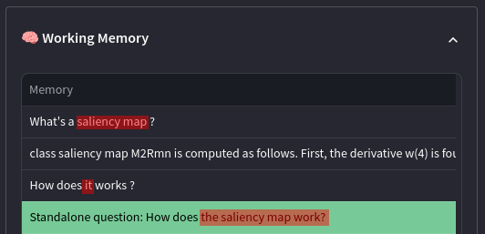

# Conversing with your private data (No API calls, it's all yours)

The code for this repo was motivated by the fact that the [Langchain](https://python.langchain.com/docs/get_started/introduction.html) 🦜️ have many working example
of how to augment a language model with various source of data using the OpenAI API.  
However, I am not sure the use of the OpenAI API is private enough when working with sensitive data (for companies).  

So I started developing a similar approach using Langchain yes but with open source models coming from [HuggingFace](https://huggingface.co/) 🤗  
This way I have all the flexibility to:
- Fine-tune the model (e.g with PEFT)
- Align the model with RLHF
- Use the model in a private way (no API)

For the moment, I have only implemented:  
- [x] Retrieval on my data using vector storage
- [x] Two chain types
  - Stuff
  - Refine
- [x] Prompt generation regarding the chain type
- [x] Memory (For follow-up conversation)
- [x] Prompt generation for memory
- [x] A Nice UI using [Streamlit](https://streamlit.io/) + a debug section to follow the LLM Thought process (Made from scratch)

I am still looking for more things to implement. The repo is not meant to be a full-fledge product, I am just having some fun.  

Note: Because of the limited hardware I have, I am using a small model (flan-t5-large) with no additional training. The goal is to have a working prototype of 
the things described above.

## The memory implemented
For this project I have implemented a memory in order to handle follow-up conversation. The memory is of length 3 and is implemented as a FIFO queue.
Here is an example of how it works:
- User: What is the weather today in Paris?
- LLM: It is sunny in Paris today.
- User: What about tomorrow?

From this point, the memory will be **full** (length 3), so I trigger the LLM in order to generate a standalone question that will replace all the history in the memory.

- LLM (standalone): What is the weather tomorrow in Paris?

With this approach, I am able to handle follow-up conversation and keep a clean memory.  
Here is an example from my app:

We can see that the 3rd question **How does it work?** do not contain any information about **saliency map**. But using the history, the LLM is able 
to generate a standalone question that is relevant: **How does the saliency map work?**.

